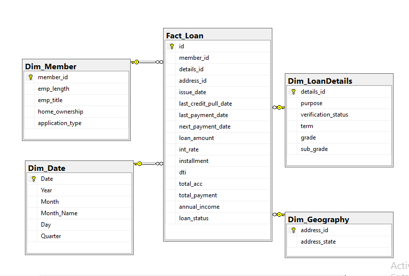
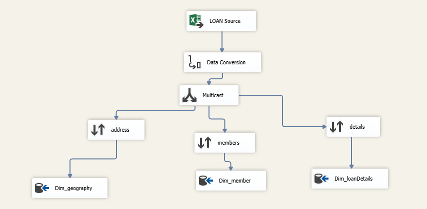
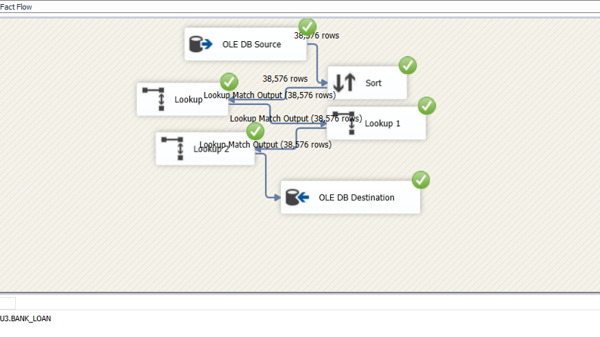
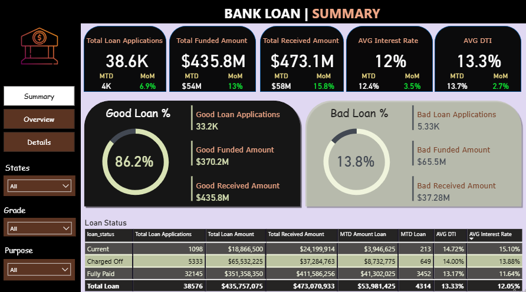
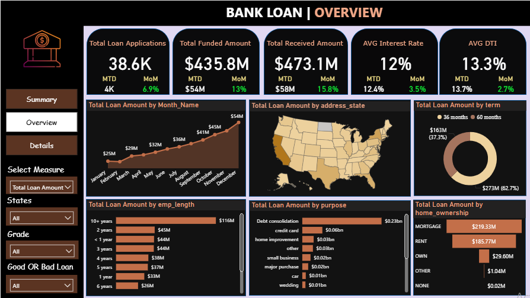
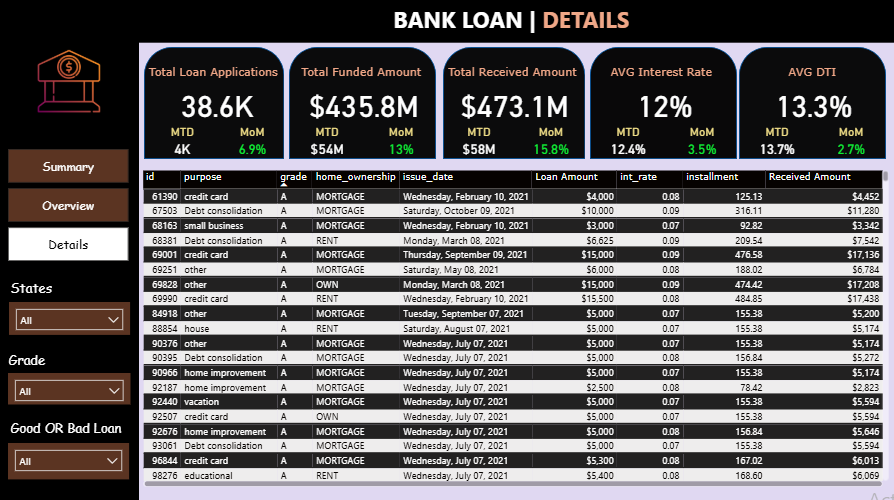

# Bank-Loan-Analysis-and-Performance-Reporting

In the dynamic landscape of banking and financial services, effective loan portfolio management is crucial for sustainable growth and risk mitigation. Understanding loan performance, identifying risk patterns, and monitoring key metrics are essential for making data-driven decisions that optimize returns while minimizing defaults.

This project provides a comprehensive analysis of bank loan data through an end-to-end business intelligence solution. By leveraging data warehousing principles and powerful visualization tools, I've built a robust reporting system that transforms raw loan data into actionable insights for portfolio management and risk assessment.

## Project Overview
The primary objective of this project is to analyze bank loan performance, monitor portfolio health, and identify key risk indicators. The project follows a structured four-phase approach:

### 1. Data Preparation and Data Warehousing
- Started with raw Excel data containing comprehensive loan application information
- Designed and implemented a **star schema** in **SQL Server** for optimal analytical performance
- Created fact and dimension tables to organize loan data efficiently

**DWH Structure:**  

### 2. ETL Process with SSIS
- Developed comprehensive ETL packages using **SSIS (SQL Server Integration Services)**
- Processed 38,576 loan records through multiple lookup transformations
- Ensured data integrity and consistency across all dimensions

**SSIS ETL Implementation:**  
**Dimensions Data Flow:**  

**Fact Data Flow:**  

### 3. Data Visualization with Power BI
- Connected directly to the data warehouse for real-time insights
- Developed interactive dashboards with comprehensive KPI tracking
- Implemented detailed loan status analysis and performance metrics

**Power BI Dashboard**  

## Technologies Used
- **SQL Server** – Data warehousing and schema design
- **SSIS** – ETL processes and data transformation
- **Power BI** – Interactive dashboards and data visualization
- **Excel** – Initial data source and validation

## Executive Summary
The bank currently manages a loan portfolio totaling $435.8 Million funded, with a healthy 86.2% Good Loan Rate. However, the analysis highlights specific risk concentrations: the average DTI is 13.3%, indicating moderate overall debt burden, but this spikes significantly for certain loan statuses. Month-over-Month (MoM) growth indicates strong recent momentum, with Funded Amount growing 13% MoM. The key challenge lies in managing the high-interest-rate, high-DTI segments, particularly in specific grades and states.
## 🔎 Insights / Findings

### 1. Portfolio Health and Risk Concentration

* **High Portfolio Health:** The overall **Good Loan % (86.2%)** is robust, suggesting effective initial screening processes.
* **Concentrated Losses:** While overall losses are low, the **Bad Loan % (13.8%)** represents **$65.5 Million** in funded amount, requiring focused collection strategies.
* **Key Risk Metric:** The **DTI** for current loans is **14.72%** at an **Average Interest Rate of 15.10%**, suggesting the bank is appropriately pricing high-risk borrowers with higher interest rates.

### 2. Time-Series Performance and Momentum

* **Strong Recent Growth:** The last month showed significant momentum: **Total Funded Amount grew by 13% MoM ($54 Million)**. This confirms successful recent lending activities.
* **Consistent Monthly Trend:** The Total Loan Amount by Month chart reveals a steady, upward trend throughout the year, peaking towards the end of the calendar year, which may indicate seasonal demand or effective Q4 marketing efforts.

### 3. Segment Analysis and Pricing Strategy

* **Purpose and Term Drivers:** **Debt Consolidation** remains the largest single purpose for lending, confirming its role as a core product. The overwhelming preference for the **60-month term (62.7% of total loan amount)** suggests borrowers prioritize lower monthly payments over shorter debt duration.
* **Geographic Focus:** The Map Visual quickly identifies states that contribute the most to the total loan amount, indicating where the bank’s marketing and branch efforts are most successful.
* **Grade Pricing Validation:** The loan status table confirms that the bank's pricing strategy is largely sound: loans in the 'Current' status have a higher interest rate (15.10%) than 'Fully Paid' loans (11.64%), indicating the bank charges more for perceived higher-risk applicants.

---

## 💡 Recommendations

### 1. Target High DTI/High Interest Segments

* **Action:** Initiate a re-evaluation of the collection or refinancing strategy for the 'Current' status loans, which show the highest average DTI and Interest Rate. These borrowers are at the highest risk of transitioning to 'Charged Off'.

### 2. Capitalize on Term Preference

* **Action:** Develop and promote tiered products that incentivize the dominant 60-month term segment, perhaps offering slight interest rate reductions for early commitment or offering products tailored specifically for debt consolidation, given its volume.

### 3. Deep Dive into Geographic Opportunities

* **Action:** Analyze the states with low loan volume (as shown on the map) compared to their economic potential. This can highlight underserved regions for targeted sales campaigns.

### 4. Optimize Revenue Cycle Management

* **Action:** Use the Total Received Amount measure to monitor the difference between projected and actual receipts across different loan grades, allowing for dynamic adjustments to provisioning and collection team focus.
